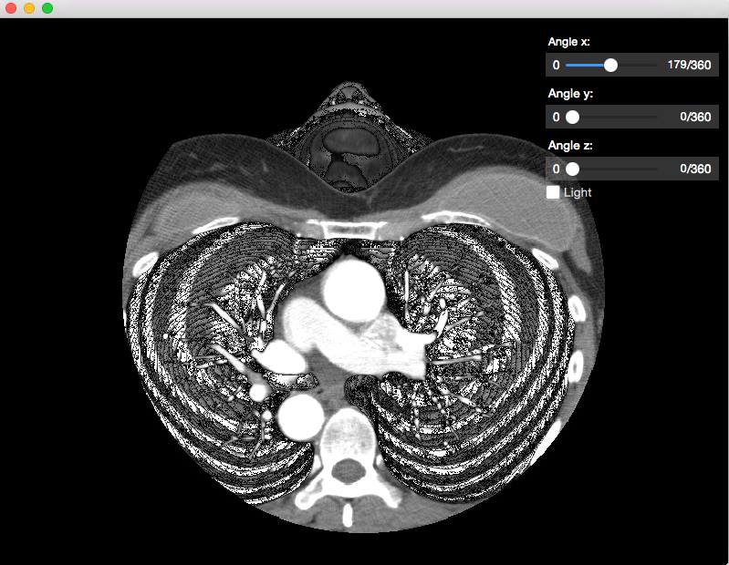
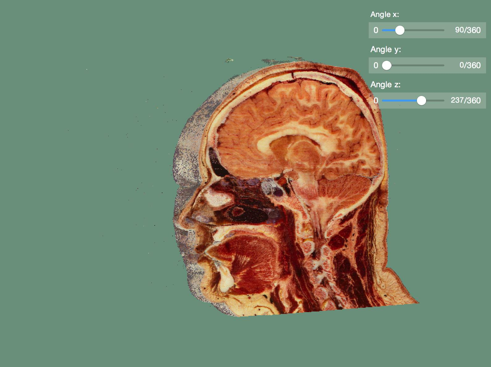
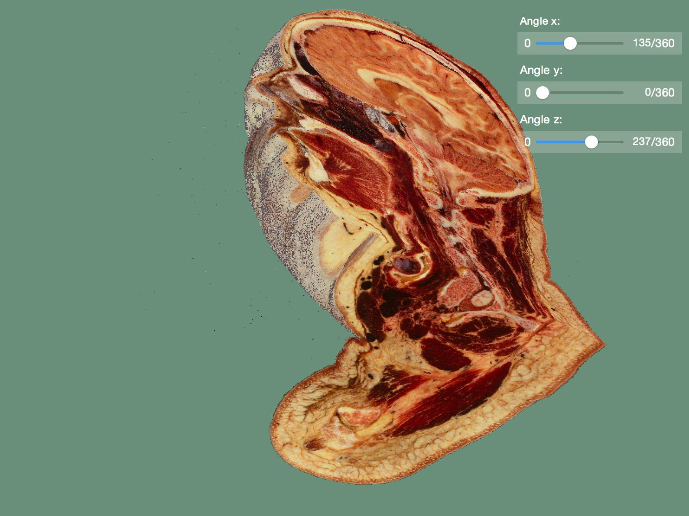
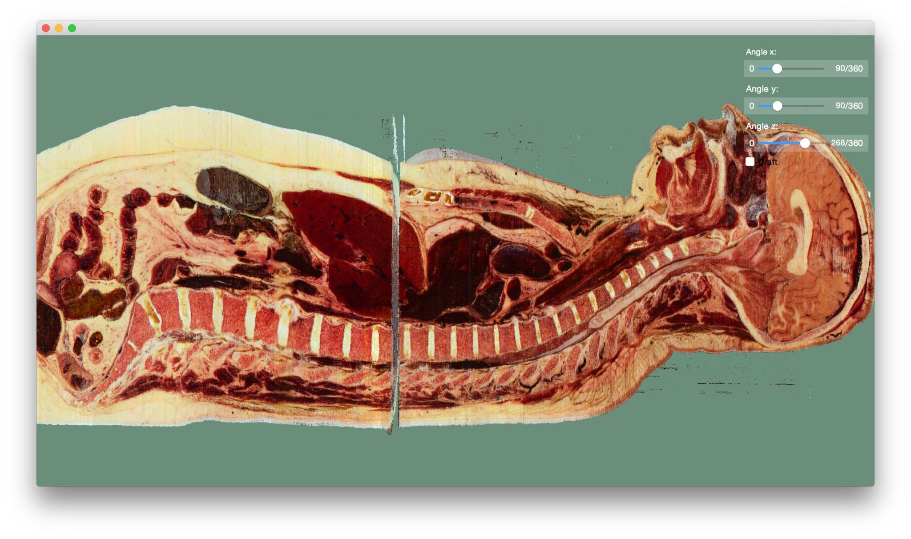
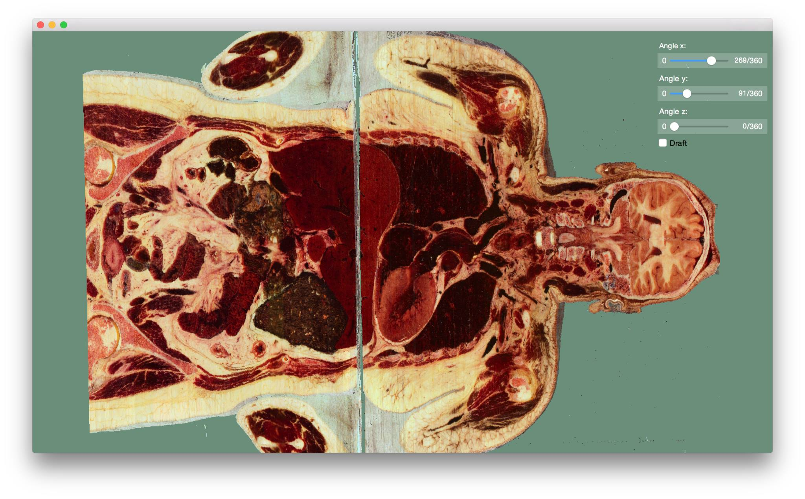

# Voxel Viewer

Allows voxel visualization from a set of images. Designed during my phd classes to allow drawing of
visible human project images in 3D.

This project was done using QT Quick 2 and C++11.

You are free to copy and modify at will.

Sample images:

Visible human project images:

Head:

Body:

